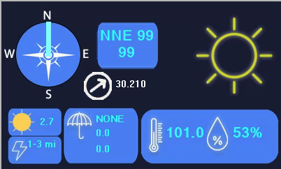
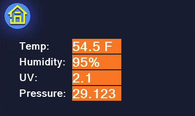
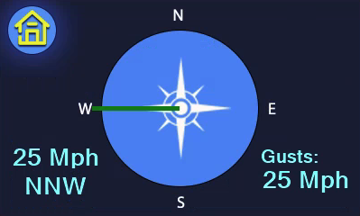
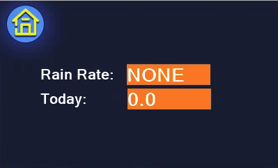
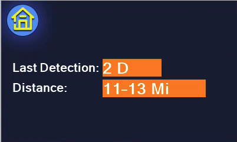

# weather-tempest-nextion 400 X 240 - Original

# About

## Display

This nextion file is designed for a Nextion NX4024K032 display

## Dimensions
400 X 240 pixels

## Author
Mike Myers

## Date
11-29-23

## License
FREE

# Example Screens

# Images

0. Sunny (Background)
1. Ascending Pressure Trend (blue background)
2. Background with no conditions (background)
3. Night Clear Sky (background)
4. Cloudy (background)
5. Heavy Rain (background)
6. Background for all sub screens
7. Partly Sunny (background)
8. Raining (background)
9. Stable Pressure Trend (blue background)
10. Thunderstorm (Background)
11. Wind screen background
12. Small Compass Rose for wind direction guage on main screen
13. Large Compass Rose for wind direction guage on wind screen
14. Decending Pressure Trend (blue background)

# Pages and Elements

## page0
Main startup page

### Elements

#### windDirection (Guage)
#### windVal (Wind Direction and Speed)
#### uvVal (UV Index)
#### lastStrikeDist (Last Lightning Distance)
#### lastStrikeTime (Last Lightning Time)
#### rainRate (Rain Rate)
#### rainToday (Rain Today)
#### gustVal (Wind Gust)
#### rainYesterday (Rain Yesterday)
#### tempVal (Temperature)
#### humidityVal (Humidity)
#### pressureVal (Pressure)
#### pressureTrend (Pressure Trend Image)

## temp

### Elements

#### pressureVal (Pressure)
#### uvVal (UV)
#### humidityVal (Humidity)
#### tempVal (Temp)

## rain

### Elements

#### rainToday (Today Rain)
#### rainRate (Rain Rate)

## lightning

### Elements

#### lastStrikeTime (Last Detection)
#### lastStrikeDist (Last Distance)

## wind

### Elements

#### windDirection (Guage)
#### windSpeed (Wind Speed)
#### windDirTxt (Wind Direction Abreviation)
#### windGustTxt (Wind Gust)
